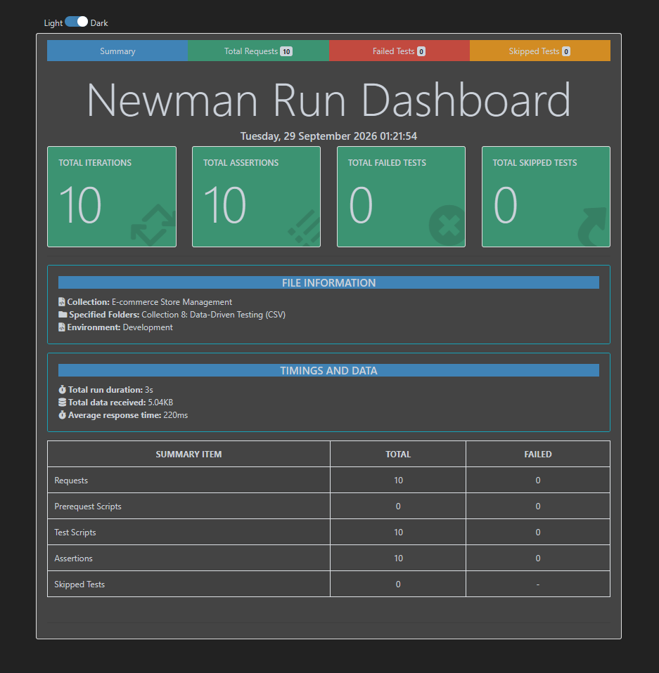

# 🛒 E-commerce Store Management API Testing

A Postman-based API testing project covering user management, products, carts, authentication, error handling, performance testing, and data-driven testing using mock REST APIs.

## 📌 Project Overview

This project contains **8 testing modules** implemented using Postman and JavaScript test scripts.

The project uses two mock APIs:

- **Fake Store API** – users, products, carts, and authentication
- **JSONPlaceholder** – users, posts, and comments

> ⚠️ The Fake Store API was unavailable during the latest execution and returned HTTP `523 Origin Is Unreachable`. Therefore, the Fake Store API-dependent tests could not be fully executed during the final validation.

---

## 🧰 Tools & Technologies

- Postman
- Newman CLI
- JavaScript (`pm` API)
- REST APIs
- JSON
- CSV Data-Driven Testing
- HTML Extra Reporter
- Git & GitHub
- Node.js / npm

---

## 📂 Project Structure

```text
E-commerce Store Management API Testing/
│
├── Development.postman_environment.json
├── E-commerce Store Management.postman_collection.json
├── ecommerce-store-api_README.md
├── user_data.csv
├── package.json
├── package-lock.json
│
└── Newman/
    ├── Collection8-DataDriven-Report.html
    ├── E-commerce Store Management.html
    └── newman-data-driven-results.png
```text
    ---

## 📊 Test Execution Results

The project was validated using **Newman CLI** with the **HTML Extra Reporter**.

### 🧪 Data-Driven Testing Dashboard



The latest data-driven execution completed successfully:

| Metric | Result |
|---|---:|
| Total Iterations | 10 |
| Total Requests | 10 |
| Total Assertions | 10 |
| Failed Tests | 0 |
| Skipped Tests | 0 |
| Average Response Time | 220 ms |

**Result: 10/10 iterations passed successfully.** ✅

The complete HTML Newman report is available in:

Newman/Collection8-DataDriven-Report.html
